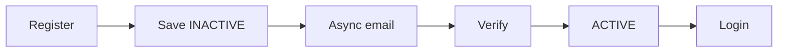
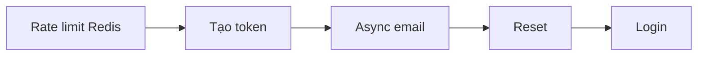
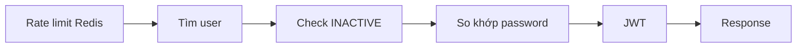

# Kiến trúc hệ thống

## 1. Flow đăng ký

```mermaid
flowchart LR
    A[Register] --> B[Save INACTIVE] --> C[Async email] --> D[Verify] --> E[ACTIVE] --> F[Login]
```

## 2. Flow forgot-password

```mermaid
flowchart LR
    A[Rate limit Redis] --> B[Tạo token] --> C[Async email] --> D[Reset] --> E[Login]
```

## 3. Flow login

```mermaid
flowchart LR
    A[Rate limit Redis] --> B[Tìm user] --> C[Check INACTIVE] --> D[So khớp password] --> E[JWT] --> F[Response]
```
